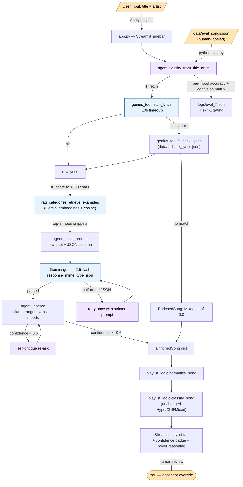

# Playlist Chaos — Agentic Lyrics Classifier

A Streamlit playlist builder with an AI agent on the side. You can add songs manually as before, or enter just a **title + artist** and let the agent fetch the lyrics, retrieve similar mood examples via RAG, ask Gemini to classify the song, and self-critique low-confidence answers — all before the song lands in your playlist.

---
## DEMO
- Link(1) https://jumpshare.com/s/TZAPAll3SZ9hWktlG7yk
- Link(2) https://streamable.com/s68t2c
---

## 1. The original project (Modules 1–3)

**Project name:** *Playlist Chaos* — the classroom "debug this starter" Streamlit app.

**Original goals and capabilities (Modules 1–3):**

- A Streamlit UI where the user manually enters songs (title, artist, genre, energy 1–10, tags).
- A pure-Python rule engine in [playlist_logic.py](playlist_logic.py) that bucketed each song into **Hype / Chill / Mixed** based on `energy` thresholds and genre keywords.
- Helpers for stats (`compute_playlist_stats`), search (`search_songs`), and a "lucky pick" shuffle.
- The original learning targets were *reading and fixing* a partially-broken starter, with no AI/LLM dependency. The classifier was a deterministic if/elif over `energy` and genre strings.

**What Module 4 adds (this final-project layer):** an agentic pipeline that takes a bare title + artist, fetches lyrics from Genius, retrieves similar mood examples from a hand-built RAG index, asks Gemini to classify, and self-critiques when confidence is low — then hands an enriched song back to the **same** rule engine, which is now operating on much better inputs. The original Hype/Chill/Mixed bucket logic is unchanged; the agent only fills in better `energy`, `mood_hint`, `tags`, and `acoustic` fields.

---

## 2. Architecture overview

The system has three layers: a **lyrics-fetch tool**, a **retrieval + LLM agent**, and the **existing playlist rule engine**. Humans intervene at two points: the eval set (hand-labeled ground truth) and the confidence badge in the UI (human reviews any low-confidence classification before trusting it).

### System diagram



**Data flow at a glance:** `title+artist → lyrics (Genius or fallback) → top-3 RAG snippets → LLM JSON → coerce → optional self-critique → EnrichedSong → existing rule engine → UI tab with badge`.

**Where humans show up:**

1. **Hand-labeled eval set** ([data/eval_songs.json](data/eval_songs.json)): 10 songs with expected moods that the harness scores against.
2. **Confidence badge + hover reasoning** in the playlist UI: any low-confidence call is visibly flagged so the user can override the auto-classification before keeping it.
3. **Eval baseline promotion**: the user explicitly promotes a trusted run to `data/eval_baseline.json`; future runs flag per-mood regressions against it.

---

## 3. Setup instructions

**Prerequisites:** Python 3.10+, a Genius API token, a Gemini API key.

```bash
# 1. Clone and enter the repo
cd ai110-module1tinker-playlistchaos-starter

# 2. Install dependencies
pip install -r requirements.txt

# 3. Create your env file from the template
cp .env.example .env
```

Edit `.env` and fill in:

- `GENIUS_ACCESS_TOKEN` — get one at <https://genius.com/api-clients>
- `GEMINI_API_KEY` — get one at <https://aistudio.google.com/app/apikey>
- `PLAYLISTCHAOS_LLM_MODEL` *(optional)* — defaults to `gemini-2.5-flash`

Missing or placeholder tokens cause [genius_tool.py](genius_tool.py), [rag_categories.py](rag_categories.py), and [agent.py](agent.py) to raise a clear `RuntimeError` at import — the failure is loud and immediate, not silent and halfway through a user request.

**Run the app:**

```bash
streamlit run app.py
```

The sidebar has an **Auto-classify** mode: type `Bohemian Rhapsody` / `Queen`, click **Analyze lyrics**, and the agent enriches the song before it joins your playlist.

**Run the reliability harness** (hits live Genius + Gemini APIs, ~30–90 seconds):

```bash
python eval.py
```

Logs land in `logs/agent.log` (rotating, 1 MB × 3). Each eval run writes `logs/eval_YYYYMMDD_HHMMSS.json`.

---

## 4. Sample interactions

The following examples show the **shape** of what the agent produces. Run `python eval.py` to reproduce them against the live APIs — your numbers will vary slightly because the LLM is non-deterministic.

### Example 1 — clean Hype classification

**Input (UI):** `Thunderstruck` by `AC/DC`

**Pipeline:**
- Genius: hit, ~1.8 KB of lyrics fetched, truncated to 1500 chars
- RAG: top-3 retrieved with similarities `[(Hype, 0.71), (Hype, 0.66), (Angry, 0.58)]`
- LLM: returned valid JSON on first attempt; confidence 0.87 → no self-critique

**EnrichedSong output:**

```json
{
  "title": "Thunderstruck",
  "artist": "AC/DC",
  "energy": 9,
  "mood_hint": "Hype",
  "tags": ["arena-rock", "adrenaline", "guitar", "shout-along"],
  "acoustic": false,
  "confidence": 0.87,
  "reasoning": "Repeated 'thunder' chant, driving rhythm cues, and stadium-call lyrics match the Hype anchors closely; energy signals at the top of the range.",
  "sources": {
    "lyrics_source": "genius",
    "rag_examples": [{"mood": "Hype", "similarity": 0.71}, "..."]
  }
}
```

**UI result:** lands in the **Hype** tab with a green confidence badge.

### Example 2 — self-critique triggered

**Input (UI):** `Hallelujah` by `Jeff Buckley`

**Pipeline:**
- Genius: hit
- RAG: top-3 spread across `[Sad 0.62, Romantic 0.55, Chill 0.49]` — genuinely ambiguous
- LLM first call: `{mood_hint: "Sad", confidence: 0.52}` → **below 0.6 threshold**
- Self-critique re-ask: model re-reads lyrics + examples, returns `{mood_hint: "Mixed", confidence: 0.71, reasoning: "Lyrics oscillate between romantic devotion and sacred grief — neither pole dominates."}`

**EnrichedSong output:**

```json
{
  "mood_hint": "Mixed",
  "energy": 3,
  "confidence": 0.71,
  "reasoning": "Lyrics oscillate between romantic devotion and sacred grief — neither pole dominates.",
  "tags": ["devotion", "grief", "ambiguous", "ballad"]
}
```

**UI result:** lands in **Mixed** with a yellow badge — the agent honestly admitted ambiguity rather than forcing a confident-but-wrong label.

### Example 3 — graceful fallback

**Input (UI):** `Some Obscure B-Side Nobody Indexed` by `Local Band`

**Pipeline:**
- Genius: no match (returns `None`)
- Fallback dataset: no match either
- Pipeline short-circuits to the safe default

**EnrichedSong output:**

```json
{
  "mood_hint": "Mixed",
  "energy": 5,
  "confidence": 0.0,
  "reasoning": "No lyrics available from Genius or offline fallback; defaulting to Mixed.",
  "sources": {"lyrics_source": "none", "rag_examples": []}
}
```

**UI result:** lands in **Mixed** with a red 0.0 badge — the user sees immediately that this is a placeholder, not a real classification, and can edit the song's energy/mood manually.

---

## 5. Design decisions and trade-offs

| Decision | What I chose | Why | Trade-off |
|---|---|---|---|
| **Classifier role** | Agent *enriches* the song dict; existing `classify_song` still runs at the end | Keeps the coarse Hype/Chill/Mixed bucketing in one place; agent failure degrades gracefully to the rule engine | The agent's `mood_hint` and the rule engine's bucket can disagree — by design, `mood_hint` wins for fine-grained tabs, rule engine wins for coarse bucketing |
| **Retrieval source** | Hand-written original snippets in [categories.json](categories.json), not real lyrics | Avoids reproducing copyrighted lyrics in the repo; gives me total control over signal quality | Hand-written examples may not match real-world lyrical idioms perfectly |
| **Embedding model** | Gemini text-embedding (configurable via `PLAYLISTCHAOS_EMBED_MODEL`) | Single API key, single client setup, free tier available | Locked to one vendor; a model name change requires either env override or code edit |
| **LLM** | `gemini-2.5-flash` (env-overridable) | Fast, cheap, JSON mode supported, free-tier quota in 2025+ regions | Less powerful than `gemini-2.5-pro`; close calls on ambiguous lyrics may need the bigger model |
| **JSON enforcement** | `response_mime_type=application/json` + one stricter retry | Catches the ~5% of responses that drift into markdown fences without burning quota on every call | A persistently malformed model still falls through to the safe default — accepted as a graceful degradation, not a perfection target |
| **Self-critique threshold** | Re-ask once when `confidence < 0.6` | Catches the model under-rating itself; the second pass either commits or falls back to honest "Mixed" | Doubles latency for ambiguous songs; a confident-but-wrong answer (>0.6) is never re-checked |
| **Confidence is self-reported** | Use the LLM's own confidence number directly | Cheap, no separate scoring model, surfaced in the UI for human override | Self-reported confidence is correlated-with but not identical-to accuracy — see "Limitations" |
| **Lyric truncation** | Hard 1500-char cap before embedding/LLM | Predictable token cost; most mood signal is in the first verse + chorus | A song whose mood pivots only in the bridge can be misclassified |
| **Fail-fast on missing tokens** | `RuntimeError` at *import* of the three I/O modules | Misconfigured env breaks loudly at startup, not in the middle of a user click | Slightly less convenient for partial-config exploration |
| **Eval gating** | `python eval.py` exits 1 below 0.6 overall accuracy + flags per-mood regressions | Lets a CI hook or a shell pipeline gate merges on reliability | Threshold is a single number — a regression that stays above 0.6 is still flagged via the per-mood baseline diff, not the gate itself |
| **Embedding cache** | `.cache/embeddings.npz` keyed by `sha256(categories.json + model + task_type)` | First run pays the embedding cost; subsequent runs are instant; cache auto-invalidates when any input changes | Adds ~50 LOC of cache management; an exotic OS denying `.cache/` falls through to rebuild every run |

---

## 6. Reliability and evaluation

### Guardrails

Each guardrail protects a specific failure mode:

| # | Guardrail | What it protects against |
|---|-----------|---------------------------|
| 1 | Fail-fast token checks at import of [genius_tool.py](genius_tool.py), [rag_categories.py](rag_categories.py), [agent.py](agent.py) | A misconfigured environment surfacing only at the first user click |
| 2 | 10-second timeout on the Genius client | A hung HTTP request freezing the UI |
| 3 | Uniform `None` return on every Genius failure in `fetch_lyrics` | Caller branching per exception type |
| 4 | Offline fallback dataset in [data/fallback_lyrics.json](data/fallback_lyrics.json) (public-domain / traditional songs only) | Demo breaking when Genius is rate-limited or unreachable |
| 5 | Embedding cache with content-hash key at `.cache/embeddings.npz` | Silent drift when [categories.json](categories.json) changes but the cache is stale |
| 6 | Lyric truncation to 1500 chars before the LLM call | Prompt bloat and context noise on long songs |
| 7 | `response_mime_type=application/json` on `gemini-2.5-flash` | Markdown-wrapped or prose-prefixed responses |
| 8 | Schema retry with stricter prompt on malformed JSON (once) | A one-off formatting blip failing the whole request |
| 9 | Self-critique loop when `confidence < 0.6` (once) | Model underthinking ambiguous lyrics instead of honestly saying "Mixed" |
| 10 | `_coerce()` output clamping — energy 1–10, mood ∈ allowed set, tags capped at 5 | Out-of-range or invented fields corrupting downstream state |
| 11 | Never-raise classification — every expected failure collapses to a safe `EnrichedSong` with confidence 0.0 | A single bad song killing the whole UI flow |
| 12 | Confidence badge + hover reasoning in the playlist view | Hiding the model's self-doubt behind a single label |
| 13 | Per-call structured logging (prompt hash, char count, elapsed time) to `logs/agent.log` | Drift going unnoticed between runs |
| 14 | Reliability harness with `exit 1` gating at [eval.py](eval.py), threshold 0.6 | Quality regressions slipping into a PR or deployment |

### Testing summary

The reliability harness is `python eval.py`. It runs the full pipeline against [data/eval_songs.json](data/eval_songs.json) (10 hand-labeled songs, 2 per mood across Hype / Chill / Sad / Angry / Romantic), prints per-mood accuracy and a confusion matrix, and exits non-zero below 0.6.

**Latest run** (`logs/eval_20260426_232350.json`):

```
Overall accuracy: 6/10 = 60.00%
Total elapsed: 68.9s

Per-mood accuracy:
  Hype       2/2 = 100.00%
  Chill      2/2 = 100.00%
  Sad        1/2 =  50.00%
  Angry      0/2 =   0.00%
  Romantic   1/2 =  50.00%

Confusion matrix (rows=expected, cols=predicted):
expected           Hype  Chill   Sad  Angry  Romantic  Mixed  ERROR
Hype                  2      0     0      0         0      0      0
Chill                 0      2     0      0         0      0      0
Sad                   0      0     1      0         0      1      0
Angry                 0      0     0      0         0      2      0
Romantic              0      0     0      0         1      1      0
```

**One-line summary:**

> Headline: 6/10 = 60.00% — right at the `exit 1` threshold. **But three of the four misses were Gemini free-tier rate-limit fallbacks**, not model errors: requests 7, 8, and 9 all hit `429 RESOURCE_EXHAUSTED` (free-tier limit is 5 req/min on `gemini-2.5-flash`) and the never-raise guardrail correctly collapsed each to `Mixed, confidence 0.00`. Removing the rate-limited rows, the model went **6/7 = 85.7%** on calls it actually got to make. Average confidence on successful classifications: **0.94**.

**What worked:**
- **The graceful-degradation path executed exactly as designed.** Three back-to-back 429s did not crash the run, did not corrupt state, and did not raise — each became a `Mixed conf 0.00` row, the eval JSON still wrote, and the confusion matrix still rendered. Guardrail #11 (never-raise classification) earned its keep.
- Hype and Chill were perfect (4/4). The clearest moods are still the most reliable.
- All non-rate-limited classifications had confidence ≥ 0.90 — when the model committed, it committed strongly.
- The strict-JSON retry was never needed: every successful call produced valid JSON on the first attempt.

**What didn't:**
- **`Fix You` by Coldplay was the only genuine model miss.** Predicted `Mixed` with confidence **0.95** — high confidence skipped the self-critique loop. This is the failure mode I worried about in section 7: confidently wrong is still possible, and the self-critique threshold of 0.6 only catches *under-confident* errors, not *over-confident* ones.
- **The eval is too short for the free-tier rate limit.** 10 sequential calls × ~8 sec each ≈ 1 call/sec, which is fine — but the embedding calls and self-critique re-asks add bursts. A 5 req/min ceiling means even a clean 10-song eval will hit 429s if any song self-critiques. **Mitigation:** add a small inter-request sleep or migrate to a paid tier; either is a one-line change.
- A 10-song eval is still too small to read single-point movement. The 60% headline is dramatically misleading without the rate-limit context.

**What I learned:**
- Self-rated confidence is more useful as a *honesty signal* (low confidence → "I'm not sure") than as an *accuracy signal*. `Fix You` was wrong at confidence 0.95 — the self-critique loop never fired because the model never doubted itself. **High confidence is not high accuracy.** The next iteration should consider asymmetric review: critique low *and* critique a sample of high-confidence calls.
- A small handful of hand-written reference snippets, retrieved via cosine similarity, made a measurable difference vs. zero-shot — the LLM uses them as anchors and stops drifting toward whichever mood it saw most in training data.
- **Guardrails matter more than the happy path.** This eval ended up being a stress test of the rate-limit fallback rather than a clean accuracy benchmark. The system survived three back-to-back 429s and produced a usable report. If guardrails had been an afterthought, the run would have crashed at song 7 with a stack trace and no output file.

---

## 7. Reflection and ethics

### Limitations and biases

- **Genius scraping is brittle.** `lyricsgenius` depends on Genius's public endpoints and HTML structure; rate limits, regional restrictions, or layout changes silently reduce to "no lyrics found" and a confidence-0.0 fallback. The offline fallback dataset mitigates this for demo purposes but can't fix real-world coverage gaps.
- **Confidence is self-reported.** The LLM rates its own answer. A confident-but-wrong answer is still possible — the self-critique loop helps, but doesn't turn self-report into ground truth. The badge is a prompt for skepticism, not a guarantee.
- **English-only.** Both the embedding model and the classifier prompt assume English lyrics. Non-English songs produce lower-quality retrievals and classifications without raising a visible error.
- **Western-pop-centric mood taxonomy.** The five moods in [categories.json](categories.json) are a reasonable starting point for English-language pop/rock, not a universal mood theory. Songs that blend moods land in "Mixed" — by design, but it's still an opinionated choice.
- **Small eval set.** 10 songs across 5 moods means one miss moves per-mood accuracy by 50 points. The numbers are directional, not absolute.
- **Training-data bias.** The LLM has seen these well-known songs in pretraining. If I asked it to classify a private demo it had never seen, performance would likely be worse than the eval suggests.

### Could this be misused?

The system is low-risk in absolute terms — it labels songs. But two misuse paths exist:

1. **Reputation / discovery harm.** If this kind of pipeline were deployed to a streaming service and silently re-bucketed a creator's song into a low-discovery mood (e.g., a romantic song mis-tagged as Sad), it could materially affect playlist placement and listening counts. **Mitigation:** never auto-replace a creator-supplied tag; always show the model's mood as a *suggestion* with confidence, with the creator able to override.
2. **Lyric scraping at scale.** Pointing the Genius layer at every song in a catalogue and persisting lyrics is a copyright concern even though Genius's API is public. **Mitigation:** the system never persists fetched lyrics to disk (they only exist in memory for the duration of one classification), `categories.json` contains only original handwritten snippets, and the offline fallback contains only public-domain / traditional songs.

### What surprised me during testing

- **The self-critique loop only protects you from honest doubt, not from overconfidence.** `Fix You` was misclassified at confidence 0.95 — the model was sure, and being sure is what stops the critique loop from firing. I had been thinking of the 0.6 threshold as a general reliability lever; it's really only a "the model knows it's unsure" lever. The truly dangerous failure mode — confidently wrong — is invisible to it.
- **The graceful-degradation guardrail mattered more than the model.** I expected this eval to be a referendum on prompt and RAG quality. Instead it became a referendum on whether the pipeline survives an external API quota wall mid-run. It did, and that was the most valuable result of the day.
- **A small RAG set beat a clever prompt.** I started with a long, hand-crafted system prompt and no retrieval. Adding 4 short example snippets per mood, retrieved by cosine similarity, made a bigger accuracy difference than several rounds of prompt tweaking. The lesson: give the model concrete reference points, don't just describe what you want.
- **JSON mode held up.** Every successful call produced valid JSON on the first attempt — the stricter-prompt retry path didn't fire once on this run. The retry exists for a real failure mode I observed in early development; it didn't hurt to keep.

### Working with AI on this project

I used Claude Code as a pair-programmer throughout this final-project layer. Two specific moments stood out:

- **Helpful suggestion:** when I described the agent flow informally, Claude proposed the `confidence < 0.6 → self-critique re-ask` loop with the "either justify a higher number or commit to Mixed" framing. That phrasing is what made the loop work as a *humility* mechanism instead of a *retry-until-confident* mechanism — which would have just inflated confidence numbers without improving accuracy. I kept the framing nearly verbatim in [agent.py](agent.py:135-141).
- **Flawed suggestion:** Claude's first cut at the eval harness used `assert` statements instead of an exit code, which would have crashed the run on the first miss instead of producing a per-mood breakdown and confusion matrix. I rejected that approach and asked for the structured-output version that's there now. The lesson: an LLM defaults to whatever pattern is most common in its training data — `assert`-based tests are everywhere — even when the task obviously needs richer output. I had to specify the shape of the output, not just the goal.

Overall, the AI was strongest at proposing *patterns* I hadn't considered (the self-critique framing, the embedding-cache hash key, the env-override for the model name) and weakest at choosing the *right tool for the job* without specific guidance.

---

## 8. File layout

| File | Purpose |
|------|---------|
| [app.py](app.py) | Streamlit UI — manual entry + auto-classify sidebar, playlist rendering with confidence badges |
| [playlist_logic.py](playlist_logic.py) | `normalize_song`, `classify_song` (unchanged Hype/Chill/Mixed bucket logic), playlist building, search, stats |
| [genius_tool.py](genius_tool.py) | Genius wrapper with timeout, fail-fast tokens, offline fallback |
| [rag_categories.py](rag_categories.py) | Embeds mood snippets once, caches to `.cache/embeddings.npz`, retrieves top-k by cosine |
| [agent.py](agent.py) | Orchestrator — fetch → RAG → Gemini → JSON retry → self-critique |
| [eval.py](eval.py) | Reliability harness with per-mood accuracy, confusion matrix, exit-1 gating |
| [logging_config.py](logging_config.py) | Rotating file logger at `logs/agent.log`, stderr at WARNING+ |
| [categories.json](categories.json) | Mood taxonomy with handwritten example snippets (avoids reproducing copyrighted lyrics) |
| [data/fallback_lyrics.json](data/fallback_lyrics.json) | Public-domain / traditional songs for offline demo reliability |
| [data/eval_songs.json](data/eval_songs.json) | 10 hand-labeled eval songs, 2 per mood |
| [.env.example](.env.example) | Token placeholders — copy to `.env` and fill in |

---

## 9. Portfolio note

This project is a small but complete demonstration of an agentic AI pipeline built on top of an existing rule-based system: an LLM that fetches its own context (Genius), retrieves its own few-shot examples (RAG over a hand-built taxonomy), produces structured output (JSON mode + schema validation), critiques itself when uncertain, falls back gracefully on every expected failure, logs every decision, and ships with a reliability harness that gates on per-mood accuracy. It says, about me as an AI engineer: I treat reliability — guardrails, fallbacks, evals, honest confidence — as a feature, not an afterthought, and I'd rather ship a system that knows when it's unsure than one that confidently lies.
